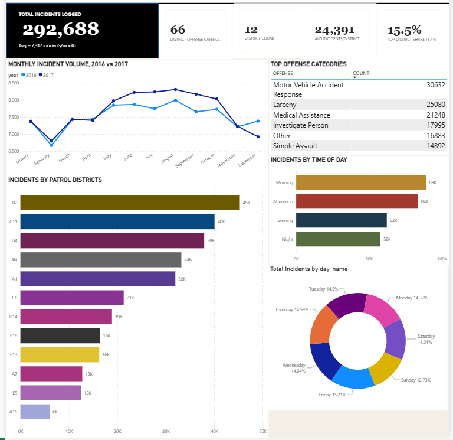

# Boston Crime Analytics Dashboard

## Overview

The Boston Crime Analytics Dashboard is an end-to-end data analytics project that explores crime incident patterns in Boston using Python and Power BI. The project focuses on transforming raw crime data into actionable insights through data cleaning, exploratory data analysis (EDA), feature engineering, and interactive dashboard development.

The dataset contains over 292,000 crime records and provides information about offense types, locations, districts, reporting areas, and incident timestamps. The final Power BI dashboard enables users to explore crime trends across districts, offense categories, and time periods.

---

## Dashboard Preview



---

## Project Objectives

* Analyze crime trends across Boston districts.
* Identify the most frequently reported offense categories.
* Examine incident patterns by month, day of week, and time of day.
* Discover crime hotspots and high-activity reporting areas.
* Build an interactive dashboard for data-driven analysis and decision-making.

---

## Dataset Information

The dataset contains historical crime incident reports from Boston and includes information such as:

* Incident Number
* Offense Code and Description
* District
* Reporting Area
* Street Location
* Date and Time of Incident
* Geographic Coordinates

After cleaning and preprocessing, approximately **292,000 crime records** were used for analysis.

---

## Tools & Technologies

* Python
* Pandas
* NumPy
* Jupyter Notebook
* Power BI
* DAX

---

## Data Preparation

The dataset was cleaned and transformed using Python before being imported into Power BI.

Key preprocessing steps included:

* Handling missing values
* Removing unnecessary columns
* Converting date and time fields
* Creating temporal features such as:

  * Hour
  * Month
  * Year
  * Day of Week
* Categorizing incidents into time-of-day segments
* Preparing the dataset for dashboard reporting and analysis

---

## Dashboard Features

The interactive Power BI dashboard includes:

* Total Crime Incidents KPI
* District-Level Crime Analysis
* Offense Category Distribution
* Incidents by Day of Week
* Incidents by Time of Day
* Monthly Crime Trends
* Top Reporting Areas
* Interactive Filtering and Drill-Down Analysis

---

## Key Insights

* Motor Vehicle Accidents emerged as one of the most frequently reported incident categories.
* District B2 recorded the highest number of incidents among all districts.
* Crime activity was concentrated during morning and afternoon hours.
* Incident volumes remained relatively consistent throughout the week.
* A small number of districts accounted for a significant share of total incidents.

---

## Repository Structure

```text
Boston-Crime-Analytics/
│
├── data/
│   └── crime_cleaned.csv
│
├── notebooks/
│   └── crimeproject.ipynb
│
├── dashboard/
│   ├── Crime_Dashboard.pbix
│   └── dashboard.png
│
└── README.md
```

---
